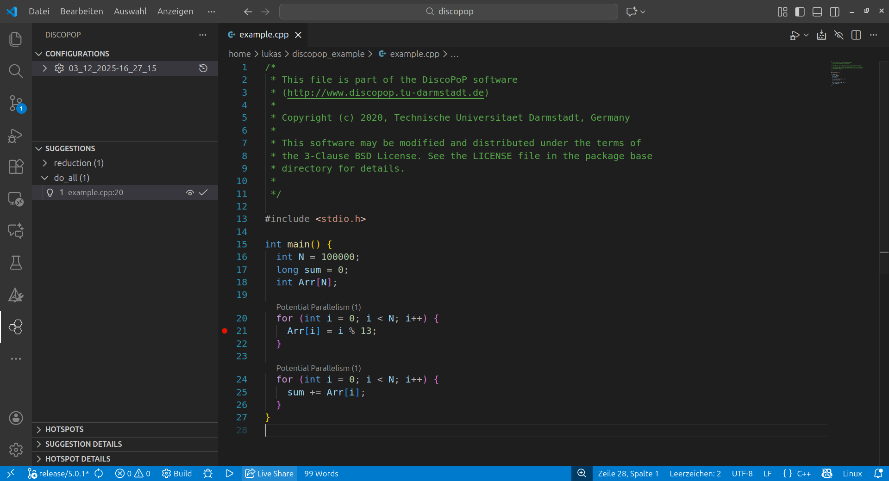
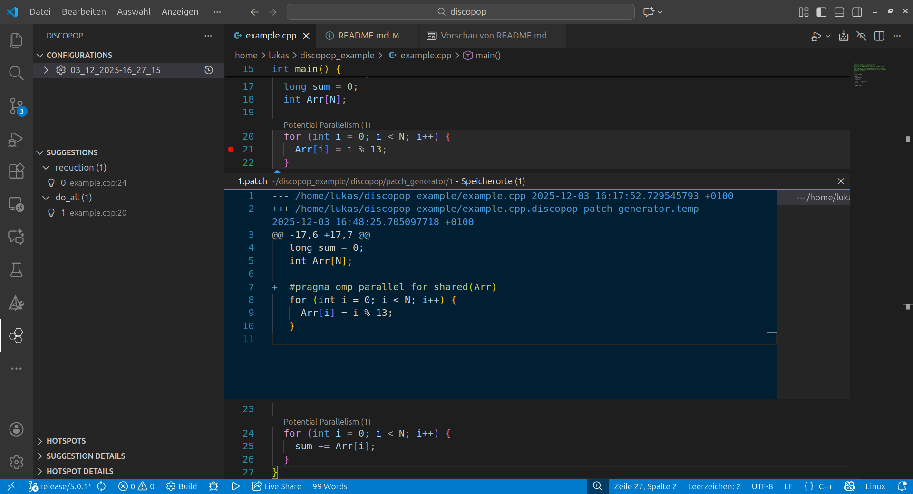

<!--
 /*
 * This file is part of the DiscoPoP software (http://www.discopop.tu-darmstadt.de)
 *
 * Copyright (c) 2020, Technische Universitaet Darmstadt, Germany
 *
 * This software may be modified and distributed under the terms of
 * the 3-Clause BSD License. See the LICENSE file in the package base
 * directory for details.
 *
 */
 -->

# DiscoPoP - Discovery of Potential Parallelism
DiscoPoP is an open-source tool that helps software developers parallelize their programs with threads. It is a joint project of the [Laboratory for Parallel Programming @ TU Darmstadt](https://github.com/tuda-parallel) and the [Software Analytics and Pervasive Parallelism Lab](https://www.cs.iastate.edu/swapp/) at Iowa State University.

In a nutshell, DiscoPoP performs the following steps:
* detect parts of the code (computational units or CUs) with little to no internal parallelization potential,
* find data dependences among them,
* identify parallel patterns that can be used to parallelize a code region,
* and finally, suggest corresponding OpenMP parallelization constructs and clauses to programmers.

DiscoPoP is built on top of LLVM. Therefore, DiscoPoP can perform the above-mentioned steps on any source code that can be transferred into the LLVM IR.

A more comprehensive overview of DiscoPoP can be found on our [project website](https://www.discopop.tu-darmstadt.de/).

## Getting started
Follow the steps in [setup](https://discopop-project.github.io/discopop/setup/discopop/) to install DiscoPoP.
To setup the [Visual Studio Code Extension](https://marketplace.visualstudio.com/items?itemName=TUDarmstadt-LaboratoryforParallelProgramming.discopop) (recommended for general use of the framework), please follow [these steps](https://discopop-project.github.io/discopop/setup/vscx/).

For a brief introduction to the [VSCode Extension](https://marketplace.visualstudio.com/items?itemName=TUDarmstadt-LaboratoryforParallelProgramming.discopop), please follow the [walk-through example](https://discopop-project.github.io/discopop/examples/walk_through_gui/).
For a brief introduction to the command line tools, please refer to the [tools overview](https://discopop-project.github.io/discopop/Tools) and follow the [command-line walk-through example](https://discopop-project.github.io/discopop/examples/walk_through/).

For detailed information on the gathered and stored data as well as the tools themselves, please refer to [data](https://discopop-project.github.io/discopop/Data) and the pages of the individual tools in the [tools overview](https://discopop-project.github.io/discopop/Tools).

## Installation
To simplify the setup we provide a Debian package via the [Release Assets](https://github.com/discopop-project/discopop/releases/latest).

## TL;DR
If you are interested in installing DiscoPoP as a `developer`, please refer to the [DiscoPoP setup wiki page](https://discopop-project.github.io/discopop/setup/discopop/).

The following example installs DiscoPoP for `users`, instruments and builds the provided example, analyzes the results, and prints the identified parallelization suggestions to the console.
In case any issues arise during the process, please refer to the detailed [setup instructions](https://discopop-project.github.io/discopop/Setup), contact us via GitHub messages, or get in contact by mail to [discopop-support@lists.parallel.informatik.tu-darmstadt.de](mailto:discopop-support@lists.parallel.informatik.tu-darmstadt.de).

### Prerequisites
- Download and install `.deb` package from [latest Release](https://github.com/discopop-project/discopop/releases/latest).
- Install the [Visual Studio Code Extension](https://marketplace.visualstudio.com/items?itemName=TUDarmstadt-LaboratoryforParallelProgramming.discopop)
### Example
Instrument and execute the code.
```
# create a copy of the example code
cp -r /opt/DiscoPoP/example discopop_example
cd discopop_example

# instrument and build the example code
discopop_cxx example.cpp -o example

# execute instrumented code
./example
```

Execute the pattern analysis on the gathered data.
```
# identify parallel patterns
cd .discopop
discopop_explorer
```

Navigate to the `DiscoPoP` extension tab in Visual Studio Code to browse the created parallelization suggestions.
Analyzing new projects, like the example code will lead to the automatic creation of a project configuration in the `Configurations` view.
By default, the current timestamp will be used (in the following screenshots, `03_12_2025-16_27_15`).
Click the clock-like `Load Results` button next to the configuration name to load the identified parallelization suggestions.
Suggestions can be browsed, previewed, and applied via the `Suggestions` view, or the added annotations (`Potential Parallelism(count)`) in the analyzed source code.



The following screenshot shows an exemplary suggestion preview.




## License
© DiscoPoP is available under the terms of the BSD-3-Clause license, as specified in the LICENSE file.
