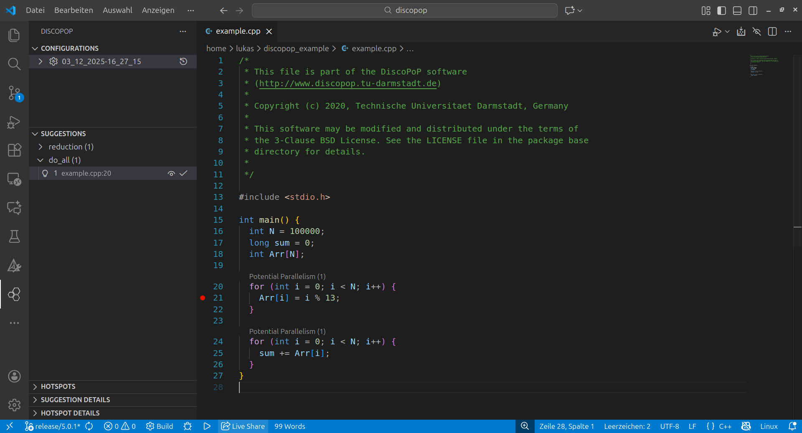
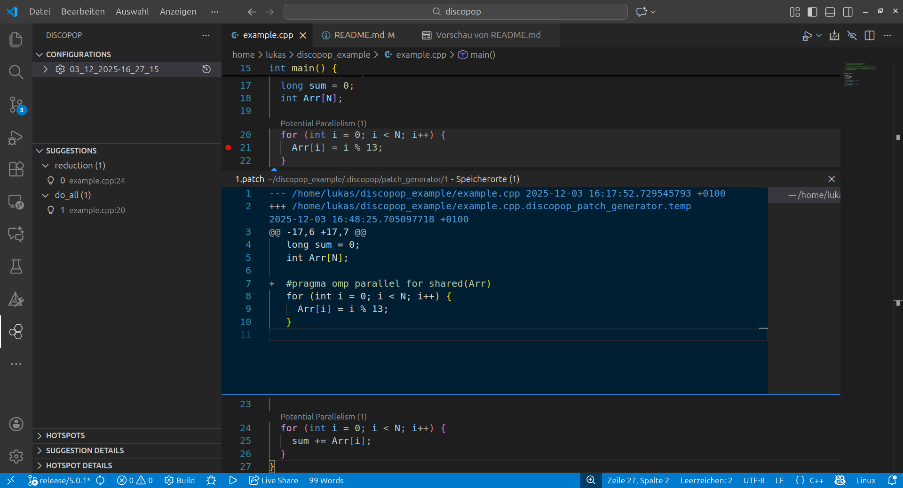

<!--
 /*
 * This file is part of the DiscoPoP software (http://www.discopop.tu-darmstadt.de)
 *
 * Copyright (c) 2020, Technische Universitaet Darmstadt, Germany
 *
 * This software may be modified and distributed under the terms of
 * the 3-Clause BSD License. See the LICENSE file in the package base
 * directory for details.
 *
 */
 -->

# DiscoPoP - Discovery of Potential Parallelism
DiscoPoP is an open-source tool that helps software developers parallelize their programs with threads. It is a joint project of the [Laboratory for Parallel Programming @ TU Darmstadt](https://github.com/tuda-parallel) and the [Software Analytics and Pervasive Parallelism Lab](https://www.cs.iastate.edu/swapp/) at Iowa State University.

In a nutshell, DiscoPoP performs the following steps:
* detect parts of the code (computational units or CUs) with little to no internal parallelization potential,
* find data dependences among them,
* identify parallel patterns that can be used to parallelize a code region,
* and finally, suggest corresponding OpenMP parallelization constructs and clauses to programmers.

DiscoPoP is built on top of LLVM. Therefore, DiscoPoP can perform the above-mentioned steps on any source code that can be transferred into the LLVM IR.

A more comprehensive overview of DiscoPoP can be found on our [project website](https://www.discopop.tu-darmstadt.de/).

## Getting started
Follow the steps below to install DiscoPoP.
To setup the [Visual Studio Code Extension](https://marketplace.visualstudio.com/items?itemName=TUDarmstadt-LaboratoryforParallelProgramming.discopop) (recommended for general use of the framework), please follow [these steps](https://discopop-project.github.io/discopop/setup/vscx/).

For a brief introduction to the [VSCode Extension](https://marketplace.visualstudio.com/items?itemName=TUDarmstadt-LaboratoryforParallelProgramming.discopop), please follow the [walk-through example](https://discopop-project.github.io/discopop/examples/walk_through_gui/).
For a brief introduction to the command line tools, please refer to the [tools overview](https://discopop-project.github.io/discopop/Tools) and follow the [command-line walk-through example](https://discopop-project.github.io/discopop/examples/walk_through/).

For detailed information on the gathered and stored data as well as the tools themselves, please refer to [data](https://discopop-project.github.io/discopop/Data) and the pages of the individual tools in the [tools overview](https://discopop-project.github.io/discopop/Tools).

## Installation
### Prerequisites
#### Via `APT` package manager
```
sudo apt install python3 python3-pip python3-venv python3-tk build-essential make cmake git llvm-19-dev clang-19 libomp-19-dev libboost-all-dev
# Replace 19 with 20, 21, or 22 if you prefer a newer LLVM release.
```

#### Via `pacman` package manager (Arch-based distributions)
```
sudo pacman -S python python-pip tk base-devel cmake git llvm clang openmp boost
# Arch ships the latest LLVM release. For a specific version (e.g., 19), install llvm19, clang19, and openmp from the AUR instead.
```

#### Via `Homebrew` package manager (macOS)
```
brew install python python-tk llvm@21 libomp boost ninja
# For a specific LLVM version (e.g., 19), use llvm@19 instead of llvm.
# Homebrew installs LLVM keg-only to avoid conflicting with Apple's clang. Add it to your PATH:
export PATH="$(brew --prefix llvm@21)/bin:$PATH"
export LDFLAGS="-L$(brew --prefix llvm@21)/lib"
export CPPFLAGS="-I$(brew --prefix llvm@21)/include"
```

### Latest release from PyPi
```
pip install discopop==5.0.3a1
```

### Local installation
```
git clone https://github.com/discopop-project/discopop.git
cd discopop
# installs profiler and python packages
make
```

### Developer
If you are interested in installing DiscoPoP as a `developer`, please refer to the [DiscoPoP setup wiki page](https://discopop-project.github.io/discopop/setup/discopop/).

## Example
The following example instruments and builds the provided example code, analyzes the results, and prints the identified parallelization suggestions to the console.
In case any issues arise during the process please do not hesitate to contact us via GitHub messages, or get in contact by mail to [discopop-support@lists.parallel.informatik.tu-darmstadt.de](mailto:discopop-support@lists.parallel.informatik.tu-darmstadt.de).

### Prerequisites
- Installed required system packages
- Installed profiler and python packages
- Installed the [Visual Studio Code Extension](https://marketplace.visualstudio.com/items?itemName=TUDarmstadt-LaboratoryforParallelProgramming.discopop) for visualization of the results.

### Example (GUI)
To launch the GUI, navigate to the project's folder and execute the `discopop` command.
```
# create a copy of the example code and enter the folder
cd discopop_example
# start the GUI. A wizard will start to help you configure your project.
discopop
```
The below explanation on the Visual Studio Code Extension is also valid when using the GUI.

### Example (manual)
Instrument and execute the code.
```
# create a copy of the example code and enter the folder
cd discopop_example

# instrument and build the example code
# use discopop_cxx for .cpp, and discopop_cc for .c files
discopop_cxx example.cpp -o example

# execute instrumented code
./example
```

Execute the pattern analysis on the gathered data.
```
# identify parallel patterns
cd .discopop
discopop_explorer
```

Navigate to the `DiscoPoP` extension tab in Visual Studio Code to browse the created parallelization suggestions.
Analyzing new projects, like the example code will lead to the automatic creation of a project configuration in the `Configurations` view.
By default, the current timestamp will be used as the configuration label (in the following screenshots, `03_12_2025-16_27_15`).
Click the clock-like `Load Results` button next to the configuration name to load the identified parallelization suggestions.
Suggestions can be browsed, previewed, and applied via the `Suggestions` view, or the added annotations (`Potential Parallelism(count)`) in the analyzed source code.
<br />
<br />

<br />
<br />
The following screenshot shows an exemplary suggestion preview.
<br />
<br />



## License
© DiscoPoP is available under the terms of the BSD-3-Clause license, as specified in the LICENSE file.
