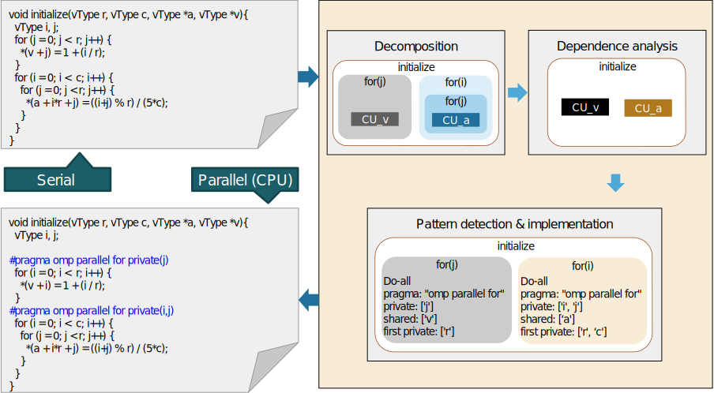
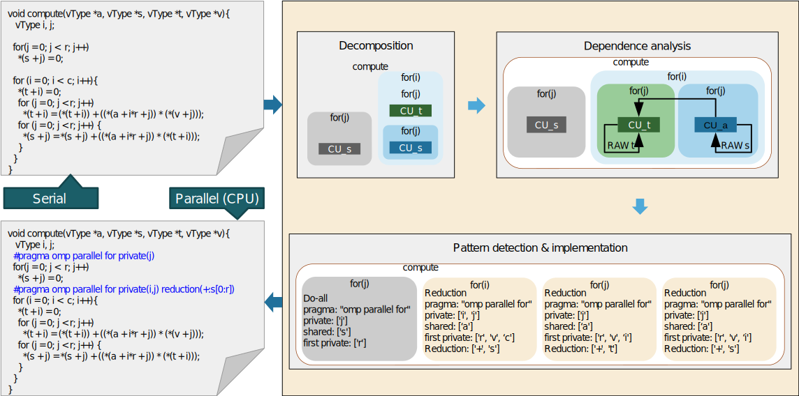

# Background Information

## Detecting parallel patterns and parallelization suggestions

Figure 1 demonstrates a simplified view of the computational units and the relevant data dependencies in the loops of function “initialize” in our test program. Based on the information, the pattern detector component (see [DiscoPoP Explorer](Pattern_Detection/DiscoPoP_Explorer.md)) identifies that the loops in the function are doall loops. Further, it suggests to wrap the loops with OpenMP parallel for constructs and the related data sharing clauses. Figure 1 also contains the parallelization suggestions. 

*(Figure 1: A simplified view of the CUs, data dependences, parallel patterns and parallelization suggestions which are identified in function “initialize” of our test program. )*

Moreover, Figure 2 shows the analysis information for function compute in the test program. Unlike the function “initialize”, there is an inter-iteration dependence which can be resolved with the OpenMP reduction clause.  

*(Figure 2:  A simplified view of the CUs, data dependences, parallel patterns and parallelization suggestions which are identified in function “compute” of our test program. )*

Please note that like many scientific applications which work on arrays or matrices, the suggestions do not change if we change the input size. Thus, it is possible to analyze the program with small inputs, obtain the parallelization suggestions and execute the parallelized version with larger inputs. However, this is a recommendation merely and it being applicable or not depends highly on the code.

Furthermore, we need to mention that DiscoPoP has an optimistic approach towards parallelization and thus programmers require to validate the final suggestions. Considering the example above, it can be easily confirmed by looking at the loops that there are no inter-iteration dependences.

## Running serial and parallel codes

You can execute the parallel code by inserting the parallelization suggestions into the source code as described in the pages for the respective parallel patterns (see [parallel patterns](Pattern_Detection/Patterns/Patterns.md)). You need to compile the parallelized program with `-fopenmp`. The speedup which is gained by parallelizing the code highly depends on the hardware platform on which you execute the serial and parallel codes.  