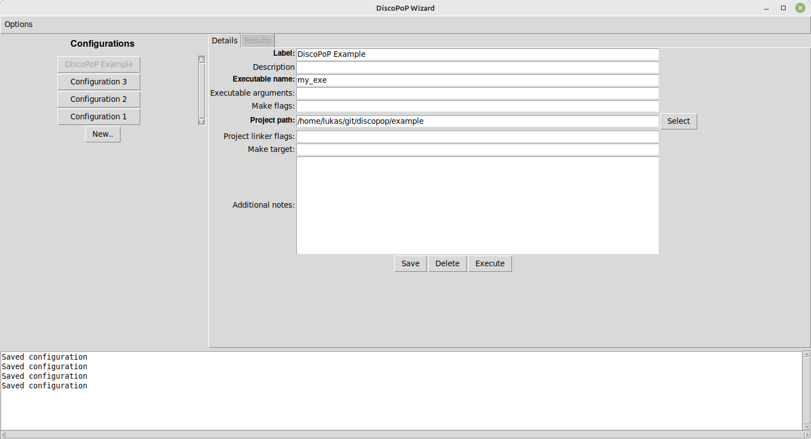
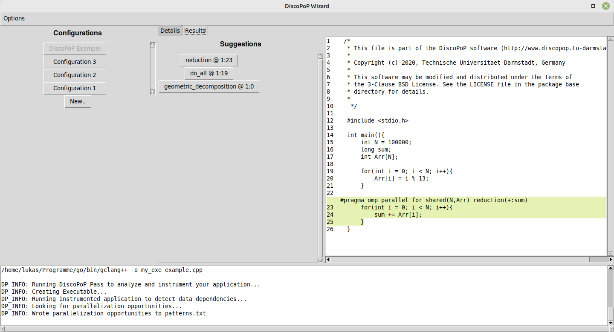
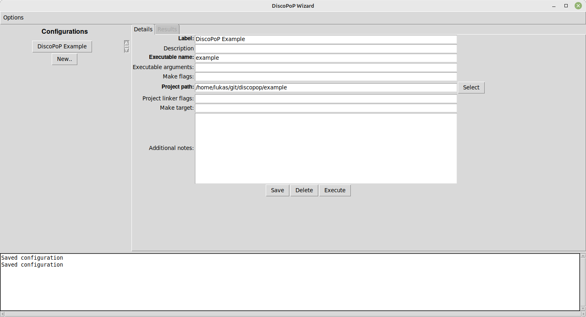

# Configuration Wizard

The DiscoPop Configuration Wizard acts as a wrapper for the [Execution Wizard](Execution_Wizard.md) and provides a graphical user interface in a terminal to simplify the management of execution configurations.

## Important Note - Prerequisites
If you want to make use of the [Configuration](Configuration_Wizard.md) or [Execution Wizard](Execution_Wizard.md) for a simplified analysis of your project, you additionally need a working installation of [gllvm](https://github.com/SRI-CSL/gllvm) and [go](https://go.dev/doc/install).

## Execution
The Wizard is provided via a python module. After successfully following the [manual setup](../Manual_Quickstart/Manual_Setup.md) it can be executed by:

    discopop_wizard

## Initial Setup
When you first start the Wizard, the `Setup` will automatically be started.
You will be prompted if you want to make use of a docker container for profiling.
If you select yes, no setup of the environment except for setting up docker is required.
Otherwise, you will be prompted for paths to folders and executables which shall be known after completing the [manual setup](../Manual_Quickstart/Manual_Setup.md) and installing [gllvm](https://github.com/SRI-CSL/gllvm) and [go](https://go.dev/doc/install).
If default values for all required paths can be determined automatically, you will be forwarded to the main menu.
If not, the `Settings` screen will be opened.
In this case, please enter the missing information and use the `Save` button to save your changes and proceed to the main menu.
You can modify the provided paths and settings at any time using the `Options->Settings` button in the main menu.

## Execution Configurations
The main menu provides an overview of the stored execution configurations.
New ones can be created using the `New..` button.
The menu to show execution results, modify, delete or execute configurations can be opened by simply clicking on a configuration.
The following figure shows the opened menu for a sample configuration.
A detailed explanation for the required settings can be found in the next section.

### Settings
#### Mandatory
* `Label`: Name of the configuration. Used to distinguish configurations in the main menu.
* `Executable name`: Name of the executable which is created when building the target project. The Name will be used to execute the configuration.
* `Project path`: Path to the project which shall be analyzed for potential parallelism.
* `Project linker flags`: Linker flags which need to be passed to the build system in order to create a valid executable.

#### Optional
* `Description`: Brief description of the configuration. Used to distinguish configurations in the main menu.
* `Executable arguments`: Specify arguments which will be forwarded to the call of the created executable for the profiling.
* `Make flags`: Specified flags will be forwarded to `Make` during the build of the target project.
* `Make target`: TODO DESCRIPTION
* `Additional notes`: Can be used to store notes regarding the configuration. This information will not be used during the execution of the configuration in any way.

## Executing the DiscoPop Pipeline
When you have entered the necessary data, use the `Save` button in order to save your changes.
The stored configuration can be executed by simply pressing the `Execute` button afterwards.
In the background, a command to call the [Execution Wizard](Execution_Wizard.md) is assembled using the stored settings and the information stored in the current execution configuration.

## Results
As of right now, the created [parallelization suggestions](../Pattern_Detection/Patterns) will be printed to a file named `patterns.txt` in the project folder.
This is not an ideal solution and will be improved in the future.
The DiscoPoP Wizard provides a simple overview of the identified suggestions. The respective view can be opened by clicking on the `Results` tab of a configuration on the main screen and will be opened automatically after an execution has finished.
The identified parallelization suggestions are shown via buttons in the middle column of the screen and allow to open a code preview, which highlights the target code section and shows the suggested OpenMP pragma.
All details regarding the suggestion can be made visible by hovering over the respective buttons.
An example for this view can be found in the following figure:

## Data Storage
All created metadata (settings and execution configurations) will be stored in a folder named `.config`, located within the installation directory of the `Configuration Wizard`.
Settings are stored within a file named `SETTINGS.txt` in a JSON format.
Execution configurations are stored as executable scripts named `<ID>_<Label>.sh` (the above-mentioned example configuration would be stored in a file named `"CD4PUSV2_Dummy project.sh"`).
The stored scripts can be executed without using the `Configuration Wizard`, as they contain all the necessary information.
They are located in a folder named `.config/execution_configurations`.
Since we make hard assumptions regarding the format of the mentioned files, please ensure that you maintain the predefined format in the case that you modify any of the mentioned files manually.

# Walk-through Example
This example will demonstrate all the required steps to setup the Configuration Wizard and analyze the provided example code for parallelization potential.

## Step 1: Execute the Wizard
Following a successful [manual setup](../Manual_Quickstart/Manual_Setup.md), the Wizard module can be started using:

    discopop_wizard

## Step 2: Setup
At the first start you will be prompted whether a docker container should be to execute DiscoPoP.
The benefit of this is, that no manual setup of the execution environment will be necessary (see `Using Docker Container`).
Note, that the first execution may take some minutes and potentially significantly longer than successive ones, since the used container needs to be set up.
If you like to use a local installation of DiscoPoP, select `No` and follow the `Using local installation` section.

### Using Docker Container
If you selected `Yes`, you will be forwarded to the main menu.
You can disable the usage of a docker container at any point in the `Options->Settings`.

### Using local installation
In order to use a local installation, you have to provide paths to your `DiscoPoP build folder` and your `Go binary` folder.
Both can be specified by simply following the opened prompts:

After specifying both paths, all required paths will be detected automatically, if possible.
If this is not possible, the `Settings` screen will open automatically.
In this case, please enter the missing information and validate the suggested values.
Use `Save` to proceed.

Note: You can enable the use of a docker container to execute DiscoPoP at any point in the `Options->Settings`.

## Step 3: Create a Execution Configuration
Use the `New..` button to create a new configuration.
Use the shown values (except for `project path`) for the provided example:

## Step 4: Execute
The configuration can be executed by simply clicking the `Execute` button.
If you use a docker container, it will be started (and potentially set up at the first start) automatically.
The results of the executed analysis are printed to a folder named `.discopop`, located inside the specified `project path`, in this case `discopop/example`.
The detected parallelization suggestions will be stored in files named `patterns.txt` and `patterns.json`.
After the execution has finished, a screen showing the identified parallelization suggestions will open automatically.

## Step 5: Interpret and Implement
The created parallelization suggestions can be browsed and shown in a code preview:

Hovering over the suggestions will show all gathered information.

Note: Assembling the suggested OpenMP pragma for the preview is not yet supported for all pattern types.
In such cases, please refer to the detailed explanations of the [patterns](../Pattern_Detection/Patterns/Patterns.md) for instructions how to interpret the respective suggestions based on the gathered Information.
