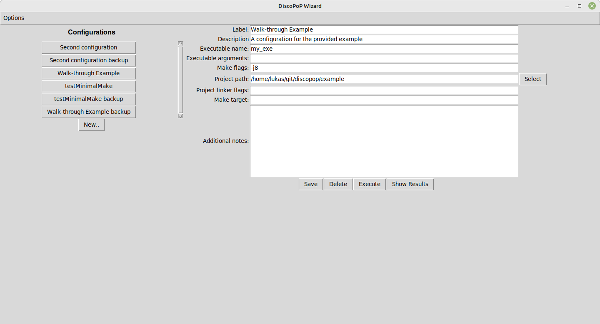

# Configuration Wizard

The DiscoPop Configuration Wizard acts as a wrapper for the [Execution Wizard](Execution_Wizard.md) and provides a graphical user interface in a terminal to simplify the management of execution configurations.

## Important Note - Prerequisites
If you want to make use of the [Configuration](Configuration_Wizard.md) or [Execution Wizard](Execution_Wizard.md) for a simplified analysis of your project, you additionally need a working installation of [gllvm](https://github.com/SRI-CSL/gllvm) and [go](https://go.dev/doc/install).

## Execution
The Wizard is provided via a python module. After successfully following the [setup](../../Setup.md) it can be executed by:

    discopop_wizard

If you are using a headless machine or, for example, an SSH Terminal to execute DiscoPoP, please make use of the `--no-gui` flag to disable prompt windows:

    discopop_wizard --no-gui

## Initial Setup
When you first start the Wizard, the `Setup` will automatically be started.
You will be prompted for paths to folders and executables which shall be known after completing the [setup](../../Setup.md) and installing [gllvm](https://github.com/SRI-CSL/gllvm) and [go](https://go.dev/doc/install).
Use the `Save` button to save your changes and proceed to the main menu.
You can modify the provided paths and settings at any time using the `Settings` button in the main menu.

## Execution Configurations
The main menu provides an overview of the stored execution configurations.
New ones can be created using the `Add Configuration` button.
The menu to store, modify, delete, copy or execute configurations can be opened by simply clicking on a configuration.
The following figure shows the opened menu for a sample configuration.
A detailed explanation for the required settings can be found in the next section.

### Settings
#### Mandatory
* `Label`: Name of the configuration. Used to distinguish configurations in the main menu.
* `Executable name`: Name of the executable which is created when building the target project. The Name will be used to execute the configuration.
* `Build threads`: Amount of threads to be used during the build process.
* `Project path`: Path to the project which shall be analyzed for potential parallelism.
* `Project linker flags`: Linker flags which need to be passed to the build system in order to create a valid executable.

#### Optional
* `Description`: Brief description of the configuration. Used to distinguish configurations in the main menu.
* `Make target`: TODO DESCRIPTION
* `Additional notes`: Can be used to store notes regarding the configuration. This information will not be used during the execution of the configuration in any way.

## Executing the DiscoPop Pipeline
When you have entered the necessary data, use the `Save` button in order to save your changes.
The stored configuration can be executed by simply pressing the `Execution` button afterwards.
In the background, a command to call the [Execution Wizard](Execution_Wizard.md) is assembled using the stored settings and the information stored in the current execution configuration.
The output of the assembled command will be printed to the `Output Console`.
Due to performance limitations in the interface framework, only a small amount of output lines can be shown at any point in time.
However, it is possible to display the full log after the execution has finished using the `Full log` button.

## Results
As of right now, the created [parallelization suggestions](../../Pattern_Detection/Patterns) will be printed to the console and thus be visible in the `Full log`.
Additionally, a file named `patterns.txt` will be created in the project folder, which stores the same information. 
This is not an ideal solution and will be improved in the future.

## Data Storage
All created metadata (settings and execution configurations) will be stored in a folder named `.config`, located within the installation directory of the `Configuration Wizard`.
Settings are stored within a file named `SETTINGS.txt` in a JSON format.
Execution configurations are stored as executable scripts named `<ID>_<Label>.sh` (the above-mentioned example configuration would be stored in a file named `"CD4PUSV2_Dummy project.sh"`).
The stored scripts can be executed without using the `Configuration Wizard`, as they contain all the necessary information.
They are located in a folder named `.config/execution_configurations`.
Since we make hard assumptions regarding the format of the mentioned files, please ensure that you maintain the predefined format in the case that you modify any of the mentioned files manually.