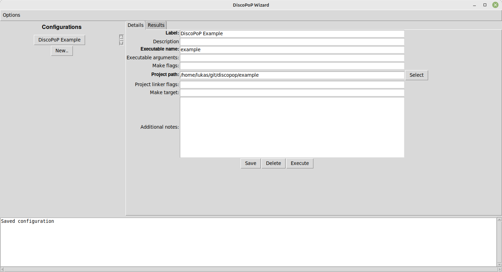
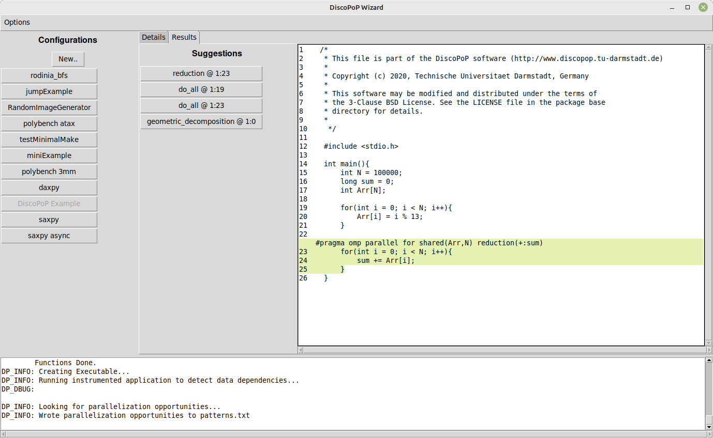

# Quickstart
The fastest and most convenient way to using DiscoPoP is provided by the [graphical user interface](Tutorials/Configuration_Wizard.md).
It can be installed from `PyPi` and offers the option to perform the necessary profiling steps using a docker container by default.
Thus, no manual setup of the environment apart from installing `docker` is required.

## Prerequisites
* `docker` is installed
* `python3` and `pip` are installed
* Projects which shall be analyzed provide a `Makefile` which fulfills the criteria mentioned [here (under "Running DiscoPoP")](index.md).

## Installation
DiscoPoP can be downloaded and installed via `pip` using the following command: `pip install discopop`, or installed from the source directory using `pip install .`

## Initial Start
The DiscoPoP GUI can be started by simply calling:

    discopop_wizard

The first start will take some time due to downloading and setting up the docker container for the profiling. 
Since the results can be cached, successive executions of the `discopop_wizard` will be faster.

## Provided Quickstart Example
To execute the profiling and analysis for the example provided in the repository, first create a new run configuration by clicking `New..`.
Only three of the possible arguments are required to execute and analyze the provided example:
* `Label`: an arbitrary name for the configuration (e.g. "Walk-through example")
* `Executable name`: Name of the executable created by the make file
  * For the provided example, use `my_exe`
* `Project path`: Path to the project which shall be analyzed
  * For the provided example, use your `ABSOLUTE_PATH_TO_DISCOPOP/example`

Click `Save` to persist the changes and `Execute` to start the profiling and analysis pipeline.

Once everything is finished, the identified parallelization suggestions will be shown automatically.
Clicking on any of them opens the code preview, which highlights the parallelizable source code section and shows the suggested OpenMP pragma. 
Details regarding a specific suggestion can be shown by hovering over the respective button.

For further details and explanations, please refer to the [Tutorial](Tutorials/Tutorials.md) as well as the pages dedicated to the [Profiling](Profiling/Profiling.md) and [Pattern Detection](Pattern_Detection/Pattern_Detection.md). 